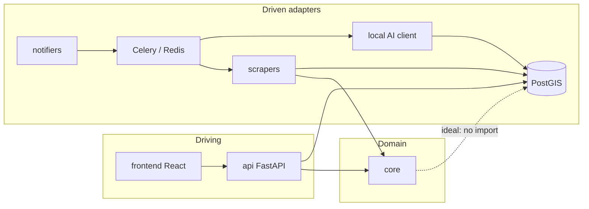
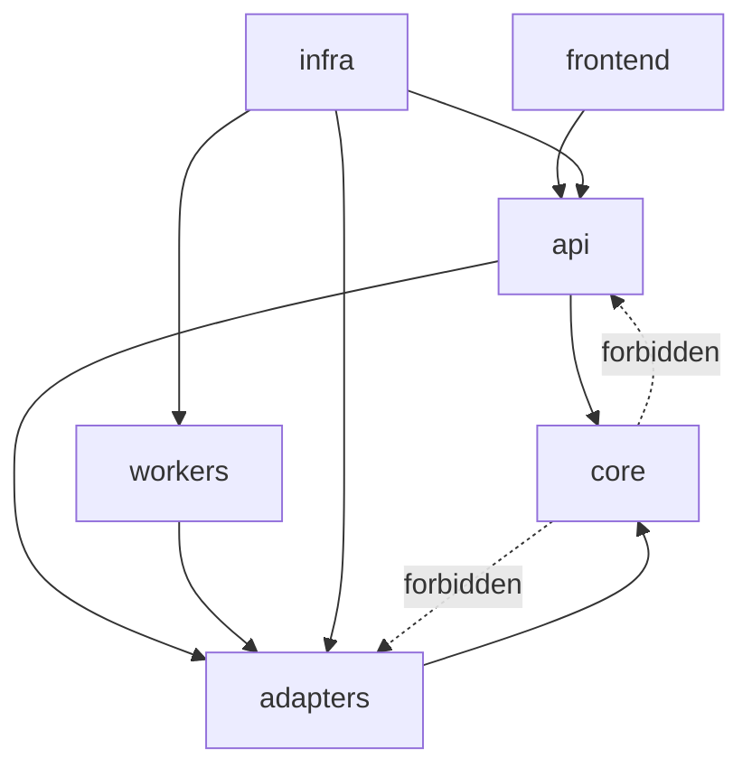
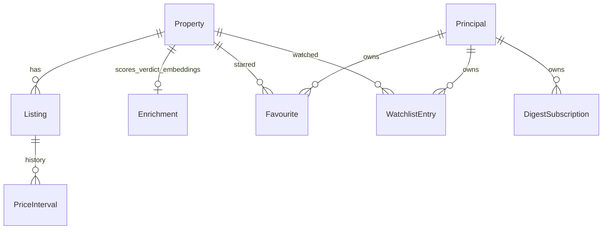

# Architecture Spine — Imoveis

## Design Paradigm

**Hexagonal (ports & adapters) for boundaries; pipes-and-filters for the ingestion/enrichment path.**

| Hexagonal role | Lives in |
| --- | --- |
| Domain | `src/core/` |
| Driving adapters (HTTP) | `src/api/` |
| Driven adapters (DB, scrapers, AI, queue, notify, metrics) | `src/adapters/` |
| Cross-cutting infra (config, DB session, Redis, logging) | `src/infra/` |
| UI client | `frontend/` |

Pipeline stages (async where noted): **scrape → normalize → dedupe → persist → score / AI enrich → alert**.


```mermaid
flowchart LR
  subgraph driving [Driving]
    API[api FastAPI]
    UI[frontend React]
  end
  subgraph domain [Domain]
    CORE[core]
  end
  subgraph driven [Driven adapters]
    SCR[scrapers]
    DB[(PostGIS)]
    Q[Celery / Redis]
    AI[local AI client]
    N[notifiers]
  end
  UI --> API
  API --> CORE
  API --> DB
  SCR --> CORE
  SCR --> DB
  Q --> SCR
  Q --> AI
  CORE -.->|ideal: no import| DB
  AI --> DB
  N --> Q
```

## Invariants & Rules

### AD-1 — Dependency direction (ideal hexagonal)

- **Binds:** `src/core/`, all FR areas that touch domain logic
- **Prevents:** Domain and adapters co-evolving into a ball of mud; parallel features importing ORM/queue into `core`
- **Rule:** `core` must not import `adapters` or `api`. Application/orchestration that needs ORM or task enqueue lives outside `core` (api, adapters, or a thin app layer). Existing `core` → adapters leaks (e.g. dedupe ORM + alert enqueue) are **debt to burn down**, not ratified. [ideal; debt]

### AD-2 — Config channel [ADOPTED]

- **Binds:** all runtime settings; FR-7, FR-19, FR-20, FR-2
- **Prevents:** Parallel features inventing `os.getenv` / hardcoded config channels
- **Rule:** Runtime settings flow only through `AppConfig` / `configs/app_config.yaml` (plus env wiring into that load path). Feature code does not call scattered `os.getenv`.

### AD-3 — Property / Listing ownership & mutation path [ADOPTED]

- **Binds:** FR-4, FR-5, FR-6, FR-16, FR-18, FR-21, FR-22; persistence + API write paths
- **Prevents:** Two meanings of “property”; identity merges or price/geo writes from random handlers; export/compare inventing alternate writers
- **Rule:** **Property** = canonical real-world home; **Listing** = platform-specific offer; price history hangs on listings. Identity/merge mutation happens only in the **dedupe path**. All Listing/Property commercial and geo fields used for containment (price, currency, platform keys, coordinates) mutate only on the **scrape → normalize → dedupe → persist** path. API/export/compare are **read-only** for those fields; snapshots are immutable projections, not second writers.

### AD-4 — AI enrichment async + GPU policy [ADOPTED]

- **Binds:** FR-7..11, FR-15; `adapters/ai`, `adapters/queue`
- **Prevents:** Inline model calls from API request threads; competing GPU concurrency schemes
- **Rule:** The API never calls models inline. **GPU-bound (local-backend) enrichment** runs only via the Celery **`ai`** queue, with concurrency owned by the ai-worker policy + GPU semaphore (single-GPU / low-concurrency story). **Cloud-bound enrichment** runs only under the AD-13 pacer. The **resumable backfill runner** (`src/core/backfill_runner.py` + `scripts/dev/backfill_gemma.py` CLI) is the **sanctioned second driver**: it bypasses queue and semaphore *by construction* — it does no GPU work, driving the shared `run_enrichment` orchestration against the remote client under the AD-13 budget, so it cannot contend with `ai`-queue workers. If it ever gains a local-backend mode, that mode goes through the `ai` queue + semaphore like any other GPU work.

### AD-5 — Scraper plugin entry [ADOPTED]

- **Binds:** FR-1..3, FR-20, FR-23 intent
- **Prevents:** One-off fetch scripts becoming a second ingestion architecture
- **Rule:** New platforms enter only as `BaseScraper` + `@register("name")` + AppConfig enablement. No first-class bypass fetchers outside the registry. Resilience (rate limits, checkpoints, circuit breakers) is part of that scraper/runtime contract — not a parallel ad-hoc HTTP stack.

### AD-6 — Auth at API edge [ADOPTED]

- **Binds:** FR-19; admin and user-gated routes; frontend
- **Prevents:** A second auth model in React diverging from the API
- **Rule:** Credential/session enforcement lives only at the **API edge** (middleware / deps). The frontend treats the API as source of truth for authz. Mechanism choice (API-key gate vs local profiles) is product-open, but **must** satisfy AD-11 once introduced — do not ship a second principal model.

### AD-7 — Local runtime topology + secrets [ADOPTED]

- **Binds:** deployment envelope; FR-7, NFR local-first
- **Prevents:** Mid-feature “deploy to cloud SaaS” forks; secret sprawl
- **Rule:** Supported shape is **Docker Compose** (Postgres/PostGIS, Redis, API, Celery scrapers + ai + beat, `ollama_init` model-pull, and **`flaresolverr`** as the opt-in Cloudflare-bypass sidecar — compose profile `bypass` + `scraping.cloudflare_bypass.enabled` in AppConfig) with **host-local AI backends** (Ollama and/or LM Studio via `LocalAIClient` / AppConfig — not required cloud SaaS AI). The only cloud AI exception is the AD-13 assist path. Secrets via env → AppConfig only; no hardcoded secrets in repo. *(Amended 2026-08-05: flaresolverr + ollama_init ratified into topology.)*

### AD-8 — Frontend I/O boundary [ADOPTED]

- **Binds:** FR-12..16, FR-18, FR-21 UI; `frontend/`
- **Prevents:** Browser talking to Redis/DB/Ollama directly
- **Rule:** React talks only to the FastAPI surface.

### AD-9 — Alerts on the pipeline [ADOPTED]

- **Binds:** FR-16, FR-21
- **Prevents:** UI-triggered one-off notification paths; dual notifier stacks for watchlist vs digest
- **Rule:** All outbound user notifications (price-drop, digest, future types) go through Celery + notifier adapters. Watchlist and digest are **rule sources** that emit onto **one** preference/channel registry (owned by one module), not separate notifier config trees. Threshold / noise control for a channel lives with that registry.

### AD-10 — Enrichment write ownership [ADOPTED]

- **Binds:** FR-7..11, FR-15, FR-22; Enrichment / score / neighbourhood cohort fields
- **Prevents:** Dual writers racing the same Enrichment row (geo job vs AI upsert)
- **Rule:** Enrichment mutation (scores, verdict, embeddings, neighbourhood assignment used for cohorts) has a **single ordered pipeline authority**: geo/neighbourhood assignment is a named stage that must not race AI upserts; column ownership and skip-unchanged keys stay with that pipeline, not with ad-hoc API or feature jobs. The **backfill runner** (see AD-4) is a sanctioned *driver* that feeds historical rows **through this same authority** — a second driver, never a second writer.

### AD-11 — Principal / owner identity [ADOPTED]

- **Binds:** FR-14, FR-16, FR-19, FR-21; favourites, saved searches, watchlist, digest, export ACL
- **Prevents:** Auth inventing `owner_id` while digest invents a disconnected subscriber
- **Rule:** One principal model owns Favourite, WatchlistEntry, SavedSearch, DigestSubscription, and export ACL. A digest subscriber **is** that principal (or a verified contact on it). Until FR-19 lands, single-tenant null-owner remains the transitional state — new features must not invent a competing identity key.

### AD-12 — Canonical property projection [ADOPTED]

- **Binds:** FR-6, FR-12, FR-18, FR-21; grid, compare, export, digest item rows
- **Prevents:** Compare and export inventing incompatible flatteners for the same Property
- **Rule:** One API-owned versioned read DTO (or shared serializer) defines primary-listing selection, price/m², enrichment fields, and neighbourhood id/label for decisioning views. FR-18 consumes it; FR-21 serializes it; no parallel ad-hoc flatteners.

### AD-13 — Cloud AI assist, bounded [ADOPTED]

- **Binds:** FR-26..29; `adapters/ai` backend routing, `core/backfill_runner.py`, Redis pacer namespace
- **Prevents:** Cloud enrichment creeping into required or incremental core paths; a second consumer racing the free-tier quota; two sources of backend-routing truth; concurrent runners double-spending the budget
- **Rule:** The Gemini/Gemma free-tier path is **optional, operator-triggered, and batch-backfill-only**: incremental (live Celery) enrichment always routes to local backends, and FR-27's per-task-class routing decides which task classes are cloud-**eligible for backfill** — never cloud-dependent for live work; the local path (Ollama / LM Studio) is never removed (NFR-1). **Every** cloud request is metered by the single Redis-backed pacer (namespace owned by `BackfillConfig.redis_prefix`, default `backfill:gemma`); configuration that would produce an unmetered cloud call (e.g. the legacy scalar `ai.backend: gemini|gemma` on a live path) must **fail FR-27's startup validation**, not run silently. Backend routing has **one** AppConfig-owned source of truth (the FR-27 task-class map, superseding the scalar key) with one startup validator — no feature-local cloud clients. At most **one** runner instance holds the backfill lease at a time (CLI and admin surface share it; budget consumption is atomic under that lease). An active backfill is operator-visible (FR-28/FR-29), and primary-DB maintenance (validate/finish cycles recreate the Postgres container) must never overlap a running backfill. Quota exhaustion / provider errors back off or degrade to the local path; they are never outages.


```mermaid
flowchart TB
  UI[frontend] --> API[api]
  API --> CORE[core]
  API --> AD[adapters]
  WORK[workers] --> AD
  AD --> CORE
  INF[infra] --> API
  INF --> AD
  INF --> WORK
  CORE -.->|forbidden| AD
  CORE -.->|forbidden| API
```

## Consistency Conventions

| Concern | Convention |
| --- | --- |
| Naming | Packages under `src/` match roles above; scrapers register by platform slug; Celery queues `scrapers` / `ai` |
| Data & formats | Property/Listing as AD-3; projections as AD-12; API errors non-blocking for UI toasts; AI/UI locale English default + pt-BR (NFR-7; BIN-64 / BIN-63) |
| Geography | Product focus BH/MG until multi-city is explicitly productized; config may allow more, UX stays BH-first |
| State & cross-cutting | Mutations per AD-3/10; config AD-2; auth AD-6/11; logging via `infra.logging`; FR-17 telemetry via `api` system/admin + existing metrics adapters — no second telemetry bus |
| Enrichment & derived stats (v0.13) | One canonical enum of enrichment task classes / signal types shared by FR-27 routing, FR-28 backfill scope, and FR-29 coverage — no per-feature vocabularies. Operator-facing coverage/ETA derives from the **DB** (FR-29); runner Redis checkpoints are internal pacing state, never a second progress metric. Derived cohort stats (FR-30 percentiles, FR-31 TCO comparisons) are computed in the metrics/enrichment pipeline stage (AD-10) on a single price basis defined there, cohort-keyed **neighbourhood × listing type** with a config-owned min-cohort size (AD-2), and consumed read-only via the AD-12 projection — no read-time re-derivation in views |
| Tests / merge | Green agent gates (`validate.sh`, scraper live gate when scrapers change) before merge — process companion to design co-existence |

## Stack

| Name | Version |
| --- | --- |
| Python (Docker runtime) | 3.11 (`Dockerfile.api`); local `.venv` may differ — image is source of truth for deploy |
| Python deps | **Pinned** via pip-compile lockfile: `requirements.in` → autogenerated `requirements.txt` (BIN-138) |
| FastAPI | 0.140.13 (lockfile) |
| SQLAlchemy | 2.0.51 (lockfile) |
| Pydantic | 2.13.4 (lockfile) |
| Celery | 5.6.3 (lockfile) |
| Redis (client / server) | client 6.4.0 (lockfile) / server `redis:7-alpine` |
| PostgreSQL + PostGIS + pgvector | Compose builds `Dockerfile.postgres` from `postgis/postgis:17-3.5-alpine` + pgvector compiled from source (BIN-272); Python `pgvector` in lockfile |
| React | 19.2.8 (`frontend/package-lock.json`) |
| Vite | 8.1.5 (`frontend/package-lock.json`) |
| maplibre-gl | 6.1.0 (lockfile-resolved from `^6.1.0`, BIN-271) |
| Local AI | Host Ollama and/or LM Studio (not containerized) |
| Cloudflare bypass | FlareSolverr `v3.3.21` sidecar, compose profile `bypass` (BIN-246) |
| Cloud assist (optional) | Gemini/Gemma free tier via `ai.backend` routing — bounded by AD-13 |

*Stack seed refreshed 2026-08-05 (sprint-change-proposal §4.2): PostGIS 17-3.5, maplibre 6, lockfile pinning — earlier "unpinned" caveats resolved by BIN-138. Prior refresh 2026-07-23 (BIN-35).*

## Structural Seed

```text
src/
  api/         # driving HTTP
  core/        # domain (ideal: no adapter imports)
  adapters/    # scrapers, db, ai, queue, notify, metrics
  infra/       # config, db session, redis, logging
  tests/
frontend/      # React client → API only
configs/app_config.yaml
alembic/
```


```mermaid
erDiagram
  Property ||--o{ Listing : has
  Listing ||--o{ PriceInterval : history
  Property ||--o| Enrichment : scores_verdict_embeddings
  Property ||--o{ Favourite : starred
  Property ||--o{ WatchlistEntry : watched
  Principal ||--o{ Favourite : owns
  Principal ||--o{ WatchlistEntry : owns
  Principal ||--o{ DigestSubscription : owns
```

Sole system of record: **Postgres + PostGIS + pgvector** (embeddings for FR-15 semantic search). Redis is queue/cache/semaphore, not the system of record.

## Capability → Architecture Map

| Capability | Lives in | Governed by |
| --- | --- | --- |
| FR-1..3 Ingestion / schedule / checkpoint | `adapters/scrapers`, `adapters/queue` | AD-5, AD-2, paradigm pipeline |
| FR-4..6 Dedupe / price history / compare prices | `core` (+ orchestration outside), `adapters/db`, `api`, `frontend` | AD-1, AD-3, AD-12 |
| FR-7..11 AI enrich / scores / skip-unchanged | `adapters/ai`, `adapters/queue`, `adapters/metrics` | AD-4, AD-2, AD-7, AD-10 |
| FR-12..15 Discovery UX / semantic search | `api`, `frontend`, DB | AD-8, AD-3, AD-12 |
| FR-16..17 Alerts / admin telemetry | `adapters/notify`, `adapters/queue`, `api` | AD-9, AD-6, AD-11, AD-4 |
| FR-18 Comparison UI | `frontend` (+ API projection) | AD-8, AD-3, AD-12 |
| FR-19 Auth | `api` edge; env/AppConfig | AD-6, AD-2, AD-11 |
| FR-20 Proxy rotation | scraper adapters + AppConfig | AD-5, AD-2 |
| FR-21 Export / digest | `api` export + pipeline digest | AD-8, AD-9, AD-11, AD-12 |
| FR-22 Neighbourhood polygons | PostGIS + enrichment pipeline stage | AD-3, AD-10, structural seed |
| FR-23..26 Shipped baseline (Zap scraper, neighbourhood quality, dual-type scoring, description enrichment) | per rows above — same homes | AD-5, AD-10, AD-4, AD-13 (FR-26 cloud batch) |
| FR-27 Multi-backend enrichment routing | `adapters/ai` + `AppConfig` | AD-13, AD-2, AD-4 |
| FR-28 Quota-governed cloud backfill surface | `core/backfill_runner.py`, `scripts/dev` CLI → operator surface | AD-13, AD-4, AD-10, AD-6 |
| FR-29 Enrichment coverage telemetry | `api` system/admin + DB-derived metrics | AD-12, AD-2; no second telemetry bus (conventions) |
| FR-30..32 Deal-intelligence (percentiles, TCO, saved-search alerts) | metrics pipeline stage (cohort stats) + `api` projection + `frontend`; alerts via pipeline | AD-10, AD-12, AD-3, AD-8, AD-9, AD-11; enrichment & derived-stats conventions |

## Deferred

| Item | Why it can wait |
| --- | --- |
| Parallel-worktree Compose port isolation | Harness / ADR 0004 — process, not product spine |
| Image tags, VRAM tuning, host-AI OS quirks | `docs/setup.md` owns operational detail |
| Git sync-with-main / merge hygiene | Feature-pipeline — design co-existence is AD-1..12 |
| FR-28 operator surface (admin panel vs hardened CLI + telemetry) | PRD §9 open question; constrained by AD-6 + AD-13 either way |
| Multi-city productization | v0.14 candidate (PRD §5); config may allow, UX stays BH-first |
| Burning down AD-1 debt in `core` | Still open as of 2026-08-05 — dedupe ORM/enqueue leak remains and lazy `adapters` imports spread (neighbourhood/overlay/enrichment_rerun/olx_location); burn-down via dedicated stories |
| Numeric success-metric instrumentation as KPIs | Product metrics — FR-29 coverage telemetry is the first step; not an architectural divergence point |
| Event-driven bus / CQRS | Rejected for current altitude |
| Multi-tenant cloud deploy | Explicit non-goal |
| Modular-monolith redraw | Rejected for retrofit |
