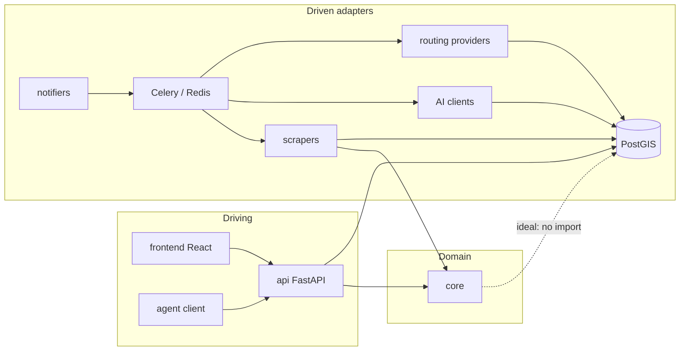
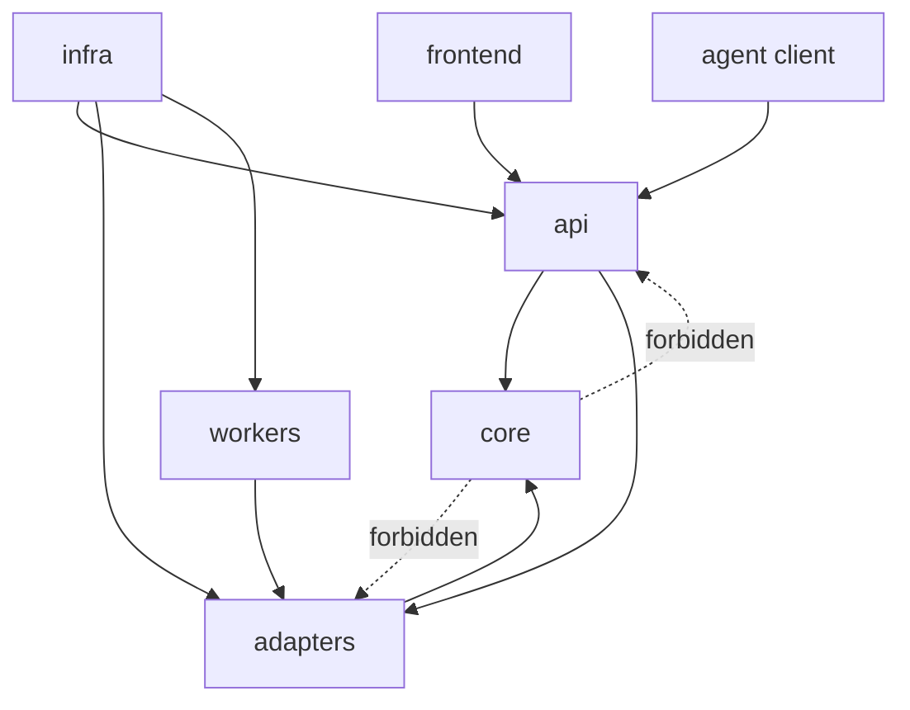
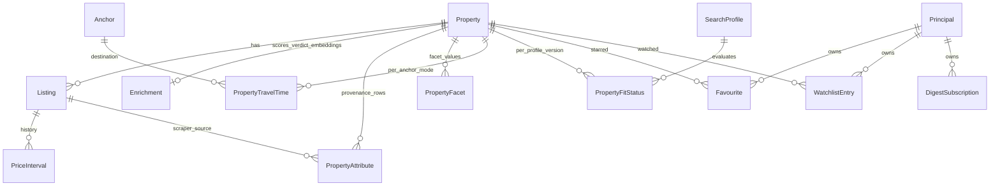
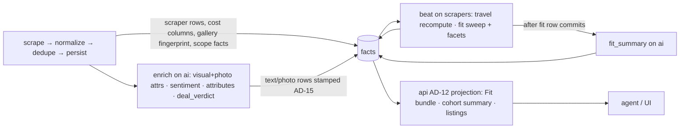

# Architecture Spine — Imoveis

## Design Paradigm

**Hexagonal (ports & adapters) for boundaries; pipes-and-filters for the ingestion → enrichment → decision path.**

| Hexagonal role | Lives in |
| --- | --- |
| Domain | `src/core/` |
| Driving adapters (HTTP) | `src/api/` |
| Driven adapters (DB, scrapers, AI, geo/routing, queue, notify, metrics) | `src/adapters/` |
| Cross-cutting infra (config, DB session, Redis, logging) | `src/infra/` |
| UI client | `frontend/` |
| Agent client (Claude Code) | outside the repo — consumes `src/api/` only |

Pipeline stages (async where noted): **scrape → normalize → dedupe → persist → score / AI enrich → travel → fit → alert**. Every stage after persist is a named writer of its own facts (AD-10, AD-14, AD-18, AD-19); nothing downstream of the API re-derives a per-Property fact at read time.


```mermaid
flowchart LR
  subgraph driving [Driving]
    API[api FastAPI]
    UI[frontend React]
    AGENT[agent client]
  end
  subgraph domain [Domain]
    CORE[core]
  end
  subgraph driven [Driven adapters]
    SCR[scrapers]
    DB[(PostGIS)]
    Q[Celery / Redis]
    AI[AI clients]
    GEO[routing providers]
    N[notifiers]
  end
  UI --> API
  AGENT --> API
  API --> CORE
  API --> DB
  SCR --> CORE
  SCR --> DB
  Q --> SCR
  Q --> AI
  Q --> GEO
  CORE -.->|ideal: no import| DB
  AI --> DB
  GEO --> DB
  N --> Q
```

## Invariants & Rules

### AD-1 — Dependency direction (ideal hexagonal)

- **Binds:** `src/core/`, all FR areas that touch domain logic
- **Prevents:** Domain and adapters co-evolving into a ball of mud; parallel features importing ORM/queue into `core`
- **Rule:** `core` must not import `adapters` or `api`. Application/orchestration that needs ORM or task enqueue lives outside `core` (api, adapters, or a thin app layer). Existing `core` → adapters leaks (e.g. dedupe ORM + alert enqueue) are **debt to burn down**, not ratified. New `core` modules minted by v0.14 (`core/attributes.py`, `core/fit.py`, cost and travel rules) are **pure** from day one — no lazy adapter imports. [ideal; debt]

### AD-2 — Config channel [ADOPTED]

- **Binds:** all runtime settings; FR-7, FR-19, FR-20, FR-2; AD-16 decision config files
- **Prevents:** Parallel features inventing `os.getenv` / hardcoded config channels; a second loader for profile/anchor/vocabulary files
- **Rule:** Runtime settings and the AD-16 decision-config objects flow only through `AppConfig` / `configs/app_config.yaml` and its loader (plus env wiring into that load path). Feature code does not call scattered `os.getenv` and does not open settings YAML itself. **DB-applied data artefacts** (neighbourhood quality YAML, safety overlays, GeoJSON) keep their idempotent apply loaders in `core`, run from `scripts/dev` — they are data, not config, and never a channel for settings or decision objects.

### AD-3 — Property / Listing ownership & mutation path [ADOPTED]

- **Binds:** FR-4, FR-5, FR-6, FR-16, FR-18, FR-21, FR-22, FR-30, FR-31; persistence + API write paths; `property_listings` cost columns; `metrics_scoring.price_basis`
- **Prevents:** Two meanings of "property"; identity merges or price/geo writes from random handlers; export/compare inventing alternate writers; cost components computed in views; two stories picking different fields as "rent"; Epic 2 and FR-31 choosing different cohort price bases
- **Rule:** **Property** = canonical real-world home; **Listing** = platform-specific offer; price history hangs on listings. Identity/merge mutation happens only in the **dedupe path**. All Listing/Property commercial and geo fields used for containment (price, currency, platform keys, coordinates, `properties.gallery_fingerprint`) mutate only on the **scrape → normalize → dedupe → persist** path. **Total Monthly Cost (FR-31)** is typed columns on `property_listings`, written only on that path: `rent_monthly` (the platform's **unbundled** rent — QuintoAndar `rentPrice`, OLX `rent_base`, ZapImóveis `price`), `condo_fee_monthly`, `iptu_monthly`, `iptu_periodicity_source` ∈ {`monthly`, `annual`, `unknown`}, `fees_bundled`, `total_monthly_cost` (rent Listings only; `NULL` when any component is `unknown` and not bundled), `cost_complete`. A missing component is `unknown`, never zero; the legacy `price` / `base_price` stay as published headline values and are **never** inputs to the total; every cost sort/filter anywhere reads `total_monthly_cost`. **Cohort price basis:** rent cohorts use fee-exclusive `rent_monthly` as the price/m² basis once FR-31 lands, stamped as `price_basis` on `metrics_scoring` (`headline` until then); Total Monthly Cost is a separate comparable, never the cohort basis; Epic 2's percentile pipeline consumes the basis through that single definition and never hardcodes `price`; the `scoring.py` change ships behind a characterization lock. API/export/compare are **read-only** for all of these; snapshots are immutable projections, not second writers.

### AD-4 — AI enrichment async + GPU policy [ADOPTED]

- **Binds:** FR-7..11, FR-15, FR-39, FR-40; `adapters/ai`, `adapters/queue`
- **Prevents:** Inline model calls from API request threads; competing GPU concurrency schemes
- **Rule:** The API never calls models inline. **GPU-bound (local-backend) enrichment** runs only via the Celery **`ai`** queue, with concurrency owned by the ai-worker policy + GPU semaphore (single-GPU / low-concurrency story). Any local OpenAI-compatible backend (LM Studio, Strata) co-resident with Ollama on the one GPU is **local GPU work under the same semaphore** — co-residency is a semaphore re-tune, never a second concurrency scheme. **Cloud-bound enrichment** runs only under the AD-13 pacer. The **resumable backfill runner** (`src/core/backfill_runner.py` + `scripts/dev/backfill_gemma.py` CLI) is the **sanctioned second driver**: it bypasses queue and semaphore *by construction* — it does no GPU work, driving the shared `run_enrichment` orchestration against the remote client under the AD-13 budget. Classes that resolve to a local backend are never run by the runner; they go through the `ai` queue like live work (AD-17).

### AD-5 — Scraper plugin entry [ADOPTED]

- **Binds:** FR-1..3, FR-20, FR-23 intent, FR-33, FR-37
- **Prevents:** One-off fetch scripts becoming a second ingestion architecture
- **Rule:** New platforms enter only as `BaseScraper` + `@register("name")` + AppConfig enablement. No first-class bypass fetchers outside the registry. Resilience (rate limits, checkpoints, circuit breakers, availability probes) is part of that scraper/runtime contract — not a parallel ad-hoc HTTP stack.

### AD-6 — Auth at API edge [ADOPTED]

- **Binds:** FR-19, FR-42; admin and user-gated routes; frontend; agent client
- **Prevents:** A second auth model in React diverging from the API; an agent-only auth surface or actor model
- **Rule:** Credential/session enforcement lives only at the **API edge** (middleware / deps). Two mechanisms are ratified and no third is added: the **API key** for machine clients (the agent included) and the **JWT admin session** for the UI; both resolve to the single AD-11 principal. Agent writes **are the operator's writes**: a star reason is a nullable `favourites.reason` column on the principal-owned row; Recheck is one principal-scoped route that the UI and the agent both call, audited in `admin_audit` with the principal id — no actor/agent column, no agent-only table; the admin batch recheck stays an operator route.

### AD-7 — Local runtime topology + secrets [ADOPTED]

- **Binds:** deployment envelope; FR-7, FR-35, NFR-1 local-first
- **Prevents:** Mid-feature "deploy to cloud SaaS" forks; secret sprawl; routing data or personal coordinates committed to the repo
- **Rule:** Supported shape is **Docker Compose** (Postgres/PostGIS, Redis, API, Celery scrapers + ai + beat, `ollama_init` model-pull, **`flaresolverr`** as the opt-in Cloudflare-bypass sidecar — compose profile `bypass` — and, from v0.14, the opt-in **`routing`** profile: two self-hosted **osrm-backend** services (`car.lua`, `foot.lua` — one `osrm-routed` per profile) + one **OpenTripPlanner 2** service, heap via `JAVA_TOOL_OPTIONS`) with **host-local AI backends** (Ollama and/or an OpenAI-compatible local server via `LocalAIClient` / AppConfig — not required cloud SaaS AI). Routing data (OSM extract, GTFS zips, built graphs) are operator-fetched artifacts under a git-ignored `data/routing/`, never committed; the ephemeral test stack never runs the `routing` profile. The only cloud AI exception is the AD-13 assist path; the only cloud routing exception is the AD-18 optional transit provider. Secrets and personal coordinates via env / git-ignored local files → AppConfig only; nothing hardcoded in the repo. *(Amended 2026-08-05: flaresolverr + ollama_init. Amended 2026-10-07: `routing` profile.)*

### AD-8 — Frontend I/O boundary [ADOPTED]

- **Binds:** FR-12..16, FR-18, FR-21 UI; FR-42; `frontend/`; agent client
- **Prevents:** Browser or agent talking to Redis/DB/Ollama/routing services directly
- **Rule:** React and the agent client talk only to the FastAPI surface. The agent never reads the DB, scrapes the UI, or calls a model or routing service itself.

### AD-9 — Alerts on the pipeline [ADOPTED]

- **Binds:** FR-16, FR-21, FR-32, FR-34
- **Prevents:** UI-triggered one-off notification paths; dual notifier stacks for watchlist vs digest vs gone-favourite
- **Rule:** All outbound user notifications (price-drop, digest, gone-favourite, future types) go through Celery + notifier adapters. Watchlist, digest and availability lifecycle are **rule sources** that emit onto **one** preference/channel registry (owned by one module), not separate notifier config trees. Threshold / noise control for a channel lives with that registry.

### AD-10 — Enrichment write ownership [ADOPTED]

- **Binds:** FR-7..11, FR-15, FR-22, FR-36, FR-39 (`text`/`photo` rows), FR-40 (`fit_summary`); Enrichment / score / neighbourhood cohort fields; `property_facets`
- **Prevents:** Dual writers racing the same Enrichment row (geo job vs AI upsert); facet or attribute rows written from ad-hoc jobs
- **Rule:** Enrichment mutation (scores, verdict, embeddings, neighbourhood assignment used for cohorts, `text`/`photo` Attribute rows, `property_facets` values, `fit_summary`) has a **single ordered pipeline authority** whose class order is the AD-17 dependency table: geo/neighbourhood assignment is a named stage that must not race AI upserts; column ownership and per-class skip keys (AD-17) stay with that pipeline, not with ad-hoc API or feature jobs. The **backfill runner** (see AD-4) is a sanctioned *driver* that feeds historical rows **through this same authority** — a second driver, never a second writer.

### AD-11 — Principal / owner identity [ADOPTED]

- **Binds:** FR-14, FR-16, FR-19, FR-21, FR-42; favourites, saved searches, watchlist, digest, export ACL
- **Prevents:** Auth inventing `owner_id` while digest invents a disconnected subscriber
- **Rule:** One principal model owns Favourite, WatchlistEntry, SavedSearch, DigestSubscription, and export ACL. A digest subscriber **is** that principal (or a verified contact on it). Until FR-19 lands, single-tenant null-owner remains the transitional state — new features (Search Profiles, Anchors, agent star/recheck) must not invent a competing identity key.

### AD-12 — Canonical property projection [ADOPTED]

- **Binds:** FR-6, FR-12, FR-18, FR-21, FR-40, FR-42; grid, compare, export, digest item rows, Fit bundle, Fit-status listing, cohort summary
- **Prevents:** Compare, export and the Fit bundle inventing incompatible flatteners for the same Property; read-time re-derivation of per-Property facts; two "deciding Listings"
- **Rule:** One API-owned versioned read DTO (or shared serializer) defines primary-listing selection, price/m², enrichment fields, neighbourhood id/label, resolved Attributes with provenance (through the one AD-14 resolver), cost components (AD-3), travel times (AD-18), facets and Fit status (AD-19) for decisioning views. Every rent-type decisioning view exposes exactly **one** `deciding_listing_id` with its `deciding_rule` ∈ {`lowest-complete-total`, `lowest-headline-price`} — the AD-19 cap Listing when a complete total exists, the legacy primary-listing rule otherwise. FR-18 consumes it; FR-21 serializes it; the FR-40 Fit bundle and the per-profile cohort summary are **assemblies of persisted rows through it**. Read-time **aggregation** over persisted per-Property facts (counts, quantiles, distributions; the cohort summary states its `price_basis`) is permitted; computing a **per-Property** derived fact (attribute, cost, travel time, facet, Fit status) at read time is not. The API never fabricates: every missing part is `unknown` with a reason (`not-computed` vs `unavailable`) and the bundle carries `unknown_count`. No parallel ad-hoc flatteners.

### AD-13 — Cloud AI assist, bounded [ADOPTED]

- **Binds:** FR-26..29, FR-39, FR-40; `adapters/ai` backend routing, `core/backfill_runner.py`, Redis pacer namespace
- **Prevents:** Cloud enrichment creeping into required or incremental core paths; a second consumer racing the free-tier quota; two sources of backend-routing truth; concurrent runners double-spending the budget
- **Rule:** The Gemini/Gemma free-tier path is **optional, operator-triggered, and batch-backfill-only**: incremental (live Celery) enrichment always routes to local backends, and FR-27's per-task-class routing decides which task classes are cloud-**eligible for backfill** — never cloud-dependent for live work; the local path (Ollama / LM Studio-compatible) is never removed (NFR-1). **Every** cloud request is metered by the single Redis-backed pacer (namespace owned by `BackfillConfig.redis_prefix`, default `backfill:gemma`); configuration that would produce an unmetered cloud call (e.g. the legacy scalar `ai.backend: gemini|gemma` on a live path) must **fail FR-27's startup validation**, not run silently. Backend routing has **one** AppConfig-owned source of truth (the FR-27 task-class map, superseding the scalar key) with one startup validator — no feature-local cloud clients. At most **one** runner instance holds the backfill lease at a time (CLI and admin surface share it; budget consumption is atomic under that lease). An active backfill is operator-visible (FR-28/FR-29), and primary-DB maintenance (validate/finish cycles recreate the Postgres container) must never overlap a running backfill. Quota exhaustion / provider errors back off or degrade to the local path; they are never outages.

### AD-14 — Attribute store: provenance rows, one resolver at read time

- **Binds:** FR-39, FR-40, FR-41, NFR-10; `adapters/db` (`property_attributes`), `core/attributes.py`, persist path, enrichment authority, dedupe merge
- **Prevents:** Attributes stored in two places (a JSON blob in `metrics_scoring.meta` vs columns on `properties`); a `text` or `photo` value overwriting a `scraper` value; two resolution implementations (SQL vs Python) drifting; three `scraper` values for one key with no tie-break; a persisted "resolved" column that silently goes stale; rows retired by one story and kept by another
- **Rule:** Attributes live in **one Property-grain table** `property_attributes`, one row per **(property, attribute key, provenance, source)**. Provenance ∈ {`scraper`, `text`, `photo`}; `unknown` is the **absence** of current rows, never a stored value. Every row carries a typed value, optional confidence in [0, 1], `observed_at`, and a **typed source** (not a JSON blob): `source_listing_id` (FK, non-null iff `scraper`), `source_field`, `source_hash` (description SHA-256 for `text`; AD-15 `evidence_set_id` for `photo`), `model_id`, `prompt_version`, `vocabulary_version` (`scraper` rows), `evidence_count` (`photo` rows). **Conflicts are rows, never merged on write.** **Resolution is implemented once**, as `core.attributes.resolve(...)` → winner + full conflict list, invoked only by the AD-12 serializer and the AD-19 fit stage — **no SQL view, no SQL-level precedence**; API filtering and sorting on decision data read the persisted `property_fit_status` / `property_travel_times` rows, never resolved attributes. Precedence across provenances is `scraper` > `text` > `photo`; **within** a provenance the winner is deterministic: `scraper` rows ordered by (active Listing before inactive, then the AD-12 primary-listing rule, then latest `observed_at`), `text` and `photo` by latest `observed_at`; losers are listed as conflicts. **Staleness is a read-time predicate per provenance, applied by that same resolver:** a `scraper` row is stale when its Listing is inactive; a `text` row when `source_hash` ≠ `sha256(current description)` or its `prompt_version` is below the class's current one; a `photo` row per AD-15. Stale rows are reported `stale` and count as `unknown`. Rows are **never deleted by feature code**; a dedupe merge re-parents rows by `property_id` and never rewrites them. Write ownership is **partitioned by provenance**: `scraper` rows are written only on the scrape → normalize → persist path (AD-3) through the committed amenity-code vocabulary (AD-16) — including the keys that have legacy columns (`bedrooms`, `bathrooms`, `parking`, `is_furnished`, `accepts_pets`), which are **row-backed from FR-39 on**; `text` and `photo` rows only by the AD-10 enrichment authority. Legacy columns are a **fallback** the resolver uses only when a Property has **no** row for that key (pre-FR-39 corpus; synthetic source `properties.<column>`, `observed_at = last_updated`) — never a competing value when rows exist. No new per-attribute columns on `properties`.

### AD-15 — Photo evidence is content-addressed, immutable, and stamped

- **Binds:** FR-39 (`photo` provenance), FR-40 (Photo evidence reference), FR-7 visual pass, FR-28/FR-29 candidate and coverage predicates; `adapters/ai/image_store.py`, `core/dedupe.py` (BIN-146 guard), `properties.gallery_fingerprint`, `metrics_scoring.meta.visual`
- **Prevents:** A `photo` Attribute inferred from a gallery a later fuzzy merge replaced; the VLM silently reading a stale cached gallery while `image_urls` shows a new one; re-enriching every Property on every merge or on every CDN query-string churn; the backfill runner, the selective rerun and coverage disagreeing on which Properties still need a visual pass; two builders defining "which photos did we look at" differently
- **Rule:** The **gallery fingerprint** is `sha256(sorted(normalize(url) for url in image_urls))` with **one** `core` normalizer (lowercase scheme/host, query string and fragment dropped); it is **persisted** as `properties.gallery_fingerprint` on the persist path (AD-3) and never recomputed in SQL; `_is_unchanged` and the fuzzy-merge path compare the same normalized list, and the fuzzy path applies the same guard as the exact path for `image_urls` / `props_json`, logging a `gallery_changed` event — the open BIN-146 follow-up is a **prerequisite** of FR-39, not optional debt. The photo gate is evaluated **once, at persist**, on that normalized list and recorded as `properties.active`; the visual stage never re-gates. The **evidence set** of a visual pass is the ordered list of SHA-256 content hashes of the files **actually fed to the model** (at least one); `evidence_set_id = sha256(sorted hashes)`. Every photo-derived fact (`property_attributes` rows with provenance `photo`, `meta.visual`) is **stamped** with `evidence_set_id`, `gallery_fingerprint`, `evidence_count`, model id and prompt version; thin evidence lowers confidence, it never withholds rows. Evidence sets are **immutable**: a changed fingerprint produces a **new** directory (`<image_storage_path>/<property_id>/<gallery_fingerprint>/`) and the cached-files-first download shortcut may only reuse files inside the current fingerprint's directory; legacy flat directories are **ignored, never adopted**. **Staleness is decided at read time** (AD-14 resolver): a photo fact whose stamped fingerprint ≠ `properties.gallery_fingerprint` is `stale` and counts as `unknown`. The **visual candidate predicate** is **one SQL fragment owned by `adapters/db`**, reused by the backfill runner, the selective rerun and FR-29 coverage: *active AND gate passed AND (no stamp OR stamped fingerprint ≠ current OR stamped prompt version below current)*; `ai_score IS NULL` is retired as a candidate key (dashboard badge only). Unstamped legacy `meta.visual` keeps its score but yields **no** `photo` rows until the Property's next visual pass; the one-off catch-up is operator-triggered through the existing rerun surface, never automatic. A gated-out Property has no `photo` rows (= `unknown`), never degraded ones.

### AD-16 — Decision config objects: versioned files, one loader, personal data in a local overlay

- **Binds:** FR-41 (Search Profiles), FR-35 (Anchors), FR-39 (attribute vocabulary + amenity-code map), FR-36 (facet vocabulary + derivation rules), NFR-2; `configs/`, `infra/config.py`, `core/attributes.py`, `.gitignore`
- **Prevents:** Profiles in YAML while facets live in Python dicts; Anchor coordinates pushed to origin or leaking through env; a second config loader; invalidation keyed on mtimes, content diffs or coordinate hashes; a startup that fails on every fresh clone or gate run; YAML minting attribute keys or provenances the domain does not allow; a vocabulary bump that only reaches re-scraped Listings
- **Rule:** Search Profiles (`configs/search_profiles.yaml`), Anchors (`configs/anchors.yaml`), the attribute vocabulary with the platform amenity-code map (`configs/attribute_vocabulary.yaml`) and the facet vocabulary with per-facet derivation rules (`configs/facets.yaml`) are **versioned files under `configs/`**, loaded through the **AppConfig loader** (AD-2), validated at startup with the offending key named, and **not env-overridable** — the `IMOVEIS_*` channel never reaches them (a unit test asserts the rejection). Each object carries an **integer `version`**; that version is the **only** invalidation key for changes to the object itself (Fit re-evaluation, travel-time recompute, facet re-derivation); fact changes invalidate through the AD-19 sweep. **Personal coordinates** (Anchors, current home) live only in the git-ignored overlay `configs/anchors.local.yaml`, merged by Anchor id; each overlay entry repeats the Anchor's `version` and the loader **fails** when it differs from the committed one, so moving a coordinate forces a committed bump (= an AD-18 recompute) and a stale overlay fails fast with the id named. Coordinate validation is enforced **only when `travel_time.enabled` is true** (committed default `false`); the unit suite ships `src/tests/fixtures/anchors.local.yaml` with synthetic coordinates and no test or gate depends on the operator overlay. A **unit test fails the build** if the committed anchors file carries `lat`/`lon` or if `.gitignore` lacks `configs/anchors.local.yaml` and `data/routing/`. **Canonical attribute keys, their types and their allowed provenances are an enum in `core/attributes.py`** (the `core/enrichment.py` pattern; e.g. `home_office_capable` never allows `scraper`); YAML maps platform codes and derivation inputs **onto** those keys, never mints keys, and the loader rejects an entry whose key disallows its provenance; an unmapped platform code is logged and ignored, never guessed. `scraper` rows stamp `vocabulary_version`; a vocabulary bump is applied by a `scrapers`-queue remap task that re-runs the normalize mapping over stored `props_json` / `raw_json` for rows with an older stamp — the normalize step re-applied, not a second writer.

### AD-17 — Task classes: one enum, per-class scope and skip keys, photo Attributes ride `visual`

- **Binds:** FR-27, FR-28, FR-29, FR-39, FR-40, §6.4 Strata spike, NFR-1; `core/enrichment.py`, `adapters/ai/client.py`, `adapters/ai/prompts.py`, `run_enrichment`, backfill scope, coverage telemetry
- **Prevents:** A feature-local "attributes" job outside the routing map; photo-Attribute extraction becoming a class routable to a text-only backend; two JSON schemas for one output; `stages` string literals that cannot express a class set; a Strata pass that makes the one-client backfill runner refuse; a spike that forks code paths instead of config values
- **Rule:** `EnrichmentTaskClass` gains **`attributes`** (text extraction) and **`fit_summary`** (profile-aware text); the routing map, backfill scope and coverage telemetry extend to them through the existing full-coverage validator — no per-feature vocabulary. **Photo-derived Attributes are an output extension of the existing `visual` class call** (same prompt family, backend and AD-15 stamp), never a separate class. The `stages` string literals are **retired** in the first v0.14 story that touches `run_enrichment`: the orchestration, the `ai_enrich` task, the selective rerun and the backfill runner pass a `frozenset[EnrichmentTaskClass]`; any subset is a valid scope; dependency order is fixed in **one table in `core`** (`visual` → `attributes` → facets → `deal_verdict` → `fit_summary`); each class is a separately skippable step with its own **skip-unchanged key** persisted beside its output — `visual` (+ photo attributes): gallery fingerprint + prompt version; `sentiment`, `attributes`: description hash + prompt version; facets: `inputs_hash`; `deal_verdict`: its inputs' `enriched_at`; `fit_summary`: (profile version, fit row `evaluated_at`, prompt version). Every text class has **one Pydantic schema** (object root) that is both the validator and the `json_schema` sent as `response_format`; one invalid-JSON retry policy for all backends, where a Strata `502 structured_output_failed` is a client-side retry (Strata validates after generation, no server retry). AD-13's routing invariants apply unchanged: live path local-only; cloud = backfill-eligible under the single pacer; `embedding` never cloud. The **backfill runner's scope is derived per class from the routing map**: a class routed to a local backend is excluded from the cloud runner (it runs through the `ai` queue), any strict subset is accepted, the runner holds one client per resolved backend, and a scope whose classes resolve to different *cloud* backends still refuses — so a Strata pass shrinks the cloud scope instead of breaking `--serve`. **Before any text class routes to `lmstudio` in production**, `LMStudioClient` must reach parity (`response_format` json_object/json_schema, configurable `max_tokens`, `generate()`): a prerequisite story that is also the spike's pre-work. The **Strata spike changes only routing values in the git-ignored `.env.local`** (`IMOVEIS_AI__ENRICHMENT_ROUTING__{SENTIMENT,ATTRIBUTES,DEAL_VERDICT,FIT_SUMMARY}=lmstudio`), pins the exact Strata release it measured, and never touches code paths or the committed all-local map; `visual` and `embedding` stay on Ollama in every spike outcome.

### AD-18 — Travel time: Property × Anchor × mode rows, routed-only, local providers behind one port

- **Binds:** FR-35, FR-41 (soft preferences), FR-42 (sort by minutes, Anchor endpoint), NFR-1, NFR-10; `adapters/db` (`property_travel_times`), `adapters/geo`, AppConfig `travel_time`, compose `routing` profile, Celery beat
- **Prevents:** Haversine estimates stored or shown as travel times; km or Anchor coordinates leaking onto the wire or into logs; two routing clients with different error shapes; a cloud directions API becoming the default path; recompute on every scrape; `provider-error` rows frozen forever; travel work landing on the GPU queue; a story coding against OTP's removed REST API
- **Rule:** Travel times live in **one table** `property_travel_times` at grain **(property, anchor id, anchor version, mode, departure assumption)** → `minutes` **or** `unknown` with `reason` ∈ {`no-provider`, `unroutable`, `outside-coverage`, `provider-error`}, plus `provider`, `provider_version` (which includes the routing data version: OSM extract date, GTFS feed date), `computed_at`. **No distance is stored or exposed** — minutes are the only unit anywhere. All providers sit behind **one `TravelTimeProvider` port** in `adapters/geo`, configured by **one AppConfig section `travel_time`** (`enabled`, `osrm_car_url`, `osrm_foot_url`, `otp_url`, `default_departure`, `provider_error_backoff`, `cloud_transit.enabled = false`); `neighbourhood_access.base_url` is **not** reused. `car` and `walk` are served **only** by self-hosted **OSRM** (one `osrm-routed` per profile, `car.lua` / `foot.lua`, BH/MG extract); haversine is never written into this table (the neighbourhood access score keeps its own haversine field, labelled an estimate). `transit` is served by self-hosted **OpenTripPlanner 2** through its **GTFS GraphQL API** (`POST /otp/gtfs/v1`, `planConnection` with `earliestDeparture` — the REST `/plan` API no longer exists since 2.8.0), fed by the PBH GTFS feed and the same OSM extract, with a deterministic departure assumption (default weekday 08:00 local, per-Anchor override) that is part of the row key. A **cloud transit provider is an optional adapter behind the same port, off by default**, explicitly enabled in config, and documented as sending Property **and Anchor** coordinates off-box; with no provider enabled the value is `unknown` with reason `no-provider` — never a gate, never an estimate. **Stale** = absent row, or Property location / Anchor version / provider version changed, or reason `provider-error` past its config-owned backoff; `unroutable` / `outside-coverage` recompute only on a provider version change. Recompute is a **Celery beat job over stale rows on the `scrapers` queue**, where the geo refresh tasks already run — never per scrape, never on `ai`. `walk` is computed only for Anchors that declare a walking budget. The Anchor read endpoint returns id, label, modes, budgets and version — **never coordinates**; coordinates never appear in logs or API responses (schema test + logging-filter test).

### AD-19 — Fit evaluation: pure core function, persisted per profile version, assembled not computed

- **Binds:** FR-40, FR-41, FR-42, FR-31, FR-36, NFR-9, NFR-10; `core/fit.py`, `adapters/db` (`property_fit_status`), fit sweep, `fit_summary` class, `api` projection
- **Prevents:** Fit logic duplicated in SQL filters, the API and the UI; `fails` on unknown data; `out-of-scope` decided by a read-time spatial query; a profile change silently re-scoring history; three fact writers each inventing a Fit trigger; a `fit_summary` with no legal home or one that contradicts its status; `metrics_scoring` growing profile columns
- **Rule:** Fit evaluation is a **pure function in `core/fit.py`** over the Property's **persisted scope facts** (listing type, property type, neighbourhood / city membership and address city as resolved on the persist path), resolved Attributes (one AD-14 resolver, staleness applied), Listing cost columns (AD-3), travel rows (AD-18) and facet rows → `FitResult`. It is persisted in **`property_fit_status`** at grain **(property, profile id, profile version)** with status ∈ {`fits`, `fits-pending-verification`, `fails`, `out-of-scope`}, the named failing / unverified constraints, soft score with its unknown count, `deciding_listing_id`, `evaluated_at`, and the **`fit_summary`** text (`unknown` / `not-computed` until generated); **previous profile versions are retained**. Semantics are fixed here: an `unknown` relevant Attribute or an incomplete Total Monthly Cost can never yield `fails` — only `fits-pending-verification` with the item named; soft preferences never change status, only order within it; the lowest **complete** Total Monthly Cost among a Property's active rent Listings decides the cap. **Trigger:** fact writers never enqueue Fit; the fit stage is a **beat sweep on the `scrapers` queue** selecting Properties where `max(input updated_at)` > `evaluated_at` for the loaded profile version, or with no row for that version (every fact table that feeds Fit carries `updated_at`); it writes `property_fit_status` only and runs the facet stage for inputs that need no model call. After a status row commits, the sweep enqueues the **`fit_summary`** class on `ai`, which generates from the persisted `FitResult` **only** and is reset to `unknown` whenever the row is re-evaluated. **Reads** use only rows whose `profile_version` equals the loaded config's version (older versions through an explicit `?version=` query); a Property without a row is `unknown` / `not-computed` in the listing and in the cohort summary, counted as such, never substituted; `out-of-scope` is a persisted status like the others — no API filter re-derives geography. The Fit bundle and the cohort summary are AD-12 projections assembled from these rows.


```mermaid
flowchart TB
  UI[frontend] --> API[api]
  AGENT[agent client] --> API
  API --> CORE[core]
  API --> AD[adapters]
  WORK[workers] --> AD
  AD --> CORE
  INF[infra] --> API
  INF --> AD
  INF --> WORK
  CORE -.->|forbidden| AD
  CORE -.->|forbidden| API
```

## Consistency Conventions

| Concern | Convention |
| --- | --- |
| Naming | Packages under `src/` match roles above; scrapers register by platform slug; Celery queues `scrapers` / `ai` (geo refresh, travel-time recompute, the fit sweep and the vocabulary remap ride `scrapers`; only GPU work rides `ai`; every beat task is listed in `task_routes`); new decision tables are `property_<fact>` (`property_attributes`, `property_travel_times`, `property_facets`, `property_fit_status`) plus `scraper_runs` for FR-37; canonical vocabularies (task classes, attribute keys + allowed provenances, provenance, Fit status, unknown reasons, travel modes, deciding rules) are `str` enums in `core` |
| Data & formats | Property/Listing as AD-3; projections as AD-12; API errors non-blocking for UI toasts; AI/UI locale English default + pt-BR (NFR-7; BIN-64 / BIN-63) |
| Decision data on the wire (v0.14) | Canonical **English** enum values and ISO-8601 timestamps; pt-BR only via i18n catalogs. `unknown` is always explicit and carries a reason enum; nothing is imputed. Every derived fact carries provenance/provider and a timestamp (NFR-10). Minutes are the only distance-like unit; Anchor coordinates are never serialized. Scores and confidences are floats in [0, 1]. Breaking changes to agent-facing schemas bump the documented API version (scheme deferred; one scheme for all routes) |
| Geography | Product focus BH/MG until multi-city is explicitly productized; config may allow more, UX stays BH-first; routing extracts/feeds are BH/MG; city membership is resolved on the persist path (FR-22 polygons / address city), never at read time |
| State & cross-cutting | Mutations per AD-3/10/14/18/19; config AD-2/16; auth AD-6/11; logging via `infra.logging` with a filter that drops coordinates; FR-17 telemetry via `api` system/admin + existing metrics adapters — no second telemetry bus |
| Enrichment & derived stats (v0.13) | One canonical enum of enrichment task classes / signal types shared by FR-27 routing, FR-28 backfill scope, and FR-29 coverage — no per-feature vocabularies. Operator-facing coverage/ETA derives from the **DB** (FR-29); runner Redis checkpoints are internal pacing state, never a second progress metric. Derived cohort stats (FR-30 percentiles) are computed in the metrics/enrichment pipeline stage (AD-10) on the single price basis defined in AD-3, cohort-keyed **neighbourhood × listing type** with a config-owned min-cohort size (AD-2), and consumed read-only via the AD-12 projection — no per-Property re-derivation in views |
| Coverage telemetry (v0.14) | FR-29's DB-derived coverage extends with per-attribute-key, per-Anchor-mode, cost-completeness and per-profile Fit-status rows — same queries module, same "active Properties" denominator; `visual` coverage = stamp equals current fingerprint (the AD-15 candidate fragment); per-attribute-key coverage counts Properties whose **resolved** value (same `core` resolver, staleness applied) is non-`unknown` — a `raw_rows` figure may sit beside it, the fraction is always what Fit sees; no second telemetry source |
| Facets (v0.14) | `property_facets` rows (property, facet, value ∈ `yes`/`no`/`unknown`, confidence, `derived_from`, `inputs_hash`, `facets_version`, `updated_at`) written only by the facet stage — never `metrics_scoring.meta`, never at read time. Inputs are named by the AD-16 rule and may include neighbourhood sub-scores, normalized flag sets, resolved Attributes, the visual condition category (subject to AD-15 staleness — a stale input yields `unknown`) and normalized description-text matches; skip key `inputs_hash`; the stage runs in the AD-17 order **and** inside the AD-19 sweep so a neighbourhood-signal change re-derives without a model call. Free-text flags that map to no facet stay flags |
| Tests / merge | Green agent gates (`validate.sh`, scraper live gate when scrapers change, `validate-ai.sh` when prompts/clients change, `alembic check` for the new tables) before merge — process companion to design co-existence. No unit/integration test or gate depends on OSRM, OTP, Ollama, Strata or the operator overlay: `TravelTimeProvider` and the AI clients have in-repo fakes behind their ports; FR-39 / FR-31 / FR-41 ship with labelled fixture sets; FR-42 endpoints ship with contract tests |

## Stack

| Name | Version |
| --- | --- |
| Python (Docker runtime) | 3.11 (`Dockerfile.api`); native Windows dev uses `.venv` 3.11 + `requirements-windows.txt`; image is source of truth for deploy |
| Python deps | **Pinned** via pip-compile lockfile: `requirements.in` → autogenerated `requirements.txt` (BIN-138) |
| FastAPI | 0.140.13 (lockfile) |
| SQLAlchemy | 2.0.51 (lockfile) |
| Pydantic | 2.13.4 (lockfile) |
| Celery | 5.6.3 (lockfile) |
| Redis (client / server) | client 6.4.0 (lockfile) / server `redis:7-alpine` |
| PostgreSQL + PostGIS + pgvector | Compose builds `Dockerfile.postgres` from `postgis/postgis:17-3.5-alpine` + pgvector compiled from source (BIN-272); Python `pgvector` in lockfile |
| React | 19.2.8 (`frontend/package-lock.json`) |
| Vite | 8.1.5 (`frontend/package-lock.json`) |
| maplibre-gl | 6.1.0 (lockfile-resolved from `^6.1.0`, BIN-271) |
| Local AI | Host Ollama (`qwen2.5vl:7b` visual/text, `bge-m3` embeddings — config-owned) and/or an OpenAI-compatible local server (LM Studio-compatible client); not containerized |
| Strata (spike candidate, not adopted) | ≥ 0.1.34 (first release with the prebuilt Windows HIP engine; latest v0.1.40.1 on 2026-10-06 — the spike pins the exact release it measured; verified 2026-10-07 against the project's README, `docs/AMD_HIP.md`, `docs/DETAILS.md`); reached only through the `lmstudio` backend; `jsonschema` installed on the Strata host for strict JSON mode |
| Cloudflare bypass | FlareSolverr `v3.3.21` sidecar, compose profile `bypass` (BIN-246) |
| Car / walk routing | osrm-backend `v26.10.0` (latest release 2026-10-01; image `ghcr.io/project-osrm/osrm-backend:v26.10.0-debian` — never Docker Hub `osrm/osrm-backend`, frozen at v5.25.0; profiles at `/opt/car.lua`, `/opt/foot.lua`, one `osrm-routed` each), compose profile `routing`, BH/MG OSM extract |
| Transit routing | OpenTripPlanner `2.10.0` (official image `opentripplanner/opentripplanner:2.10.0` — plain release tags only, never `latest`; heap via `JAVA_TOOL_OPTIONS=-Xmx…`), compose profile `routing`, GTFS GraphQL API |
| BH GTFS | PBH unified feed `ckan.pbh.gov.br/dataset/gtfs` (`GTFSBHTRANS.zip`, conventional incl. MOVE + supplementary, refreshed daily; the split CON/SUP zips are still published) — fetched from PBH, never the MobilityData mirror (`mdb-9` conventional / `mdb-687` supplementary, frozen 2023-08) |
| Cloud assist (optional) | Gemini/Gemma free tier via the FR-27 routing map — bounded by AD-13 |

*Stack seed refreshed 2026-10-07 (version lens re-verified against GitHub releases, GHCR / Docker Hub tags, PBH ckan and the Strata repo): routing services + Strata candidate added, local AI models named. Prior refreshes 2026-08-05 (PostGIS 17-3.5, maplibre 6, lockfile pinning) and 2026-07-23 (BIN-35).*

## Structural Seed

```text
src/
  api/         # driving HTTP — UI and agent client; AD-12 projections incl. Fit bundle + cohort summary
  core/        # domain (ideal: no adapter imports) — enrichment.py, attributes.py (enum + resolve), fit.py, dedupe, cost/travel rules
  adapters/    # scrapers, db (candidate predicate, coverage SQL), ai, geo (osrm/otp/cloud providers behind one port), queue, notify, metrics
  infra/       # config (one loader, sibling decision-config files + anchors overlay), db session, redis, logging (coordinate filter)
  tests/       # fixtures/anchors.local.yaml (synthetic), fakes for TravelTimeProvider + AI clients
frontend/      # React client → API only
configs/
  app_config.yaml            # runtime settings (all-local routing map pinned by test; travel_time.enabled: false)
  search_profiles.yaml       # AD-16, versioned
  anchors.yaml               # AD-16 schema; coordinates ABSENT (test-pinned)
  anchors.local.yaml         # git-ignored overlay: coordinates + current home, version per Anchor
  attribute_vocabulary.yaml  # AD-16: attribute keys ← platform amenity codes
  facets.yaml                # AD-16: facet derivation rules
data/
  images/<property>/<gallery_fingerprint>/   # AD-15 immutable evidence sets
  routing/                   # git-ignored OSM extract, GTFS zips, built graphs
alembic/
```


```mermaid
erDiagram
  Property ||--o{ Listing : has
  Listing ||--o{ PriceInterval : history
  Property ||--o| Enrichment : scores_verdict_embeddings
  Property ||--o{ PropertyAttribute : provenance_rows
  Listing ||--o{ PropertyAttribute : scraper_source
  Property ||--o{ PropertyFacet : facet_values
  Property ||--o{ PropertyTravelTime : per_anchor_mode
  Property ||--o{ PropertyFitStatus : per_profile_version
  SearchProfile ||--o{ PropertyFitStatus : evaluates
  Anchor ||--o{ PropertyTravelTime : destination
  Property ||--o{ Favourite : starred
  Property ||--o{ WatchlistEntry : watched
  Principal ||--o{ Favourite : owns
  Principal ||--o{ WatchlistEntry : owns
  Principal ||--o{ DigestSubscription : owns
```

`SearchProfile` and `Anchor` are **config objects** (AD-16), referenced by id + version from the fact tables — not DB rows. Sole system of record: **Postgres + PostGIS + pgvector** (embeddings for FR-15 semantic search). Redis is queue/cache/semaphore/pacer, not the system of record.


```mermaid
flowchart LR
  S[scrape → normalize → dedupe → persist] -->|scraper rows, cost columns, gallery fingerprint, scope facts| DB[(facts)]
  S --> E[enrich on ai: visual+photo attrs · sentiment · attributes · deal_verdict]
  E -->|text/photo rows stamped AD-15| DB
  B[beat on scrapers: travel recompute · fit sweep + facets] --> DB
  DB --> B
  B -->|after fit row commits| FS[fit_summary on ai]
  FS --> DB
  DB --> P[api AD-12 projection: Fit bundle · cohort summary · listings]
  P --> A[agent / UI]
```

## Capability → Architecture Map

| Capability | Lives in | Governed by |
| --- | --- | --- |
| FR-1..3 Ingestion / schedule / checkpoint | `adapters/scrapers`, `adapters/queue` | AD-5, AD-2, paradigm pipeline |
| FR-4..6 Dedupe / price history / compare prices | `core` (+ orchestration outside), `adapters/db`, `api`, `frontend` | AD-1, AD-3, AD-12 |
| FR-7..11 AI enrich / scores / skip-unchanged | `adapters/ai`, `adapters/queue`, `adapters/metrics` | AD-4, AD-2, AD-7, AD-10, AD-15 (visual key), AD-17 (per-class keys) |
| FR-12..15 Discovery UX / semantic search | `api`, `frontend`, DB | AD-8, AD-3, AD-12 |
| FR-16..17 Alerts / admin telemetry | `adapters/notify`, `adapters/queue`, `api` | AD-9, AD-6, AD-11, AD-4 |
| FR-18 Comparison UI | `frontend` (+ API projection) | AD-8, AD-3, AD-12 |
| FR-19 Auth | `api` edge; env/AppConfig | AD-6, AD-2, AD-11 |
| FR-20 Proxy rotation | scraper adapters + AppConfig | AD-5, AD-2 |
| FR-21 Export / digest | `api` export + pipeline digest | AD-8, AD-9, AD-11, AD-12 |
| FR-22 Neighbourhood polygons | PostGIS + enrichment pipeline stage | AD-3, AD-10, structural seed |
| FR-23..26 Shipped baseline (Zap scraper, neighbourhood quality, dual-type scoring, description enrichment) | per rows above — same homes | AD-5, AD-10, AD-4, AD-13 (FR-26 cloud batch) |
| FR-27 Multi-backend enrichment routing | `adapters/ai` + `AppConfig` | AD-13, AD-2, AD-4, AD-17 |
| FR-28 Quota-governed cloud backfill surface | `core/backfill_runner.py`, `scripts/dev` CLI → operator surface | AD-13, AD-4, AD-10, AD-6, AD-17 (scope from routing map), AD-15 (candidate fragment) |
| FR-29 Enrichment coverage telemetry | `api` system/admin + DB-derived metrics | AD-12, AD-2; coverage conventions |
| FR-30, FR-32 Deal-intelligence (percentiles, saved-search alerts) — v0.13 Epic 2 in flight | metrics pipeline stage (cohort stats) + `api` projection + `frontend`; alerts via pipeline | AD-10, AD-12, AD-3 (price basis), AD-8, AD-9, AD-11 |
| FR-31 Total Monthly Cost normalization | scraper normalize + persist path (`property_listings` cost columns); `core` cost rules; `api` projection | AD-3, AD-12, AD-19; characterization lock on `scoring.py` basis change |
| FR-33 Availability recheck / FR-34 gone-resurrection lifecycle | `adapters/scrapers/availability.py`, Celery beat, notifier registry; one principal-scoped recheck route | AD-5, AD-3 (listing state on persist path), AD-6, AD-9, AD-12 (availability in Fit bundle), AD-14 (inactive Listing ⇒ stale `scraper` rows) |
| FR-35 Travel time to Anchors | `adapters/geo` providers + `property_travel_times`; AppConfig `travel_time`; compose `routing` profile; beat recompute; map bands as UI consumer | AD-18, AD-16 (Anchors), AD-7, AD-12, AD-8 |
| FR-36 Sentiment facets | facet stage in enrichment authority + fit sweep; `property_facets`; `configs/facets.yaml`; `api` filter | AD-10, AD-16, AD-19, AD-12; facets convention |
| FR-37 Scraper run-history analytics | durable `scraper_runs` table written by the existing `_record_scrape_run` seam (the capped Redis telemetry list becomes a feed, not the store); `api` system/admin | AD-5, AD-12; no second telemetry bus |
| FR-38 Recent-filter recall | `frontend` only | AD-8 |
| FR-39 Attribute extraction with provenance | `core/attributes.py` enum + resolver; `property_attributes`; scraper vocabulary map on persist path; `attributes` text class + `visual` photo extension; BIN-146 guard + `gallery_fingerprint` column | AD-14, AD-15, AD-16, AD-17, AD-10, AD-3, AD-13 |
| FR-40 Fit bundle + Fit summary | `api` AD-12 projection; `fit_summary` class on `ai` writing `property_fit_status.fit_summary` | AD-12, AD-19, AD-17, AD-10 |
| FR-41 Search Profiles + Fit status | `configs/search_profiles.yaml`; `core/fit.py`; `property_fit_status`; fit sweep on `scrapers` | AD-16, AD-19, AD-2, AD-10, AD-11 |
| FR-42 Agent query surface | `api` read endpoints + star(reason)/recheck writes; `src/api/schemas.py` + contract tests; `docs/api.md` agent section | AD-6, AD-8, AD-12, AD-11, AD-18 (no coordinates); decision-data wire convention |
| §6.4 Strata spike | `.env.local` routing values; `LMStudioClient` parity story; adapted `scripts/dev/ab_gemini_vs_ollama.py` | AD-17, AD-4, AD-13, NFR-1 |

## Deferred

| Item | Why it can wait |
| --- | --- |
| Parallel-worktree Compose port isolation | Harness / ADR 0004 — process, not product spine |
| Image tags, VRAM tuning, host-AI OS quirks, OTP JVM heap sizing (`JAVA_TOOL_OPTIONS`) | `docs/setup.md` owns operational detail; routing memory/build time verified at the FR-35 story |
| Git sync-with-main / merge hygiene | Feature-pipeline — design co-existence is AD-1..19 |
| Cloud transit provider (Google Routes / HERE) | AD-18 fixes the port and the off-by-default posture; adopt only if OTP coverage of BH leaves measured `outside-coverage` gaps; sends Anchor coordinates off-box (PRD Q2) |
| Evidence-set pruning | AD-15 directories neither current nor referenced by a non-stale `photo` row — operator script, never `docker-cleanup.sh`; decide when disk pressure is measured |
| API version scheme for agent-facing routes | No URL prefix exists today; decided at the FR-42 story under one constraint — one scheme for all routes, never `/v1` for new endpoints only |
| Strata adoption | Spike verdict (adopt / reject / defer) with A/B numbers; whichever way it lands, only `.env.local` routing values change and the cloud backfill scope shrinks accordingly (AD-17) |
| MCP wrapper over FR-42 | Convenience; the REST contract is the product surface (AD-8) |
| Profile-builder UI, per-user profiles | PRD non-goal; AD-16 config + version control is the surface |
| Attributes beyond profile needs (view, orientation, sun) | Added by extending the `core` enum + vocabulary when a profile references them (AD-16) |
| Epic 2 vs v0.14 ordering | Decided 2026-10-07 (Felipe): every pending v0.13 item (Epic 2 s2.1–s2.5, s2.7, open retro items, `fu` keys, open DW ledger entries) is transferred into the v0.14 epics pass as a carry-over epic — one deliverable plan, no separate in-flight wave; AD-19 keeps the overlap to `schemas.py` by adding `property_fit_status` instead of `metrics_scoring` columns; AD-3's single price basis gates the percentile story |
| Multi-city productization | v0.15+ candidate (PRD §5); config may allow, UX stays BH-first |
| Burning down AD-1 debt in `core` | Still open as of 2026-10-07 — dedupe ORM/enqueue leak remains and lazy `adapters` imports spread; new v0.14 `core` modules are pure (AD-1); burn-down via dedicated stories |
| Numeric success-metric instrumentation as KPIs | Product metrics — FR-29 coverage telemetry (extended, conventions) is the first step; not an architectural divergence point |
| Event-driven bus / CQRS | Rejected for current altitude |
| Multi-tenant cloud deploy | Explicit non-goal |
| Modular-monolith redraw | Rejected for retrofit |
