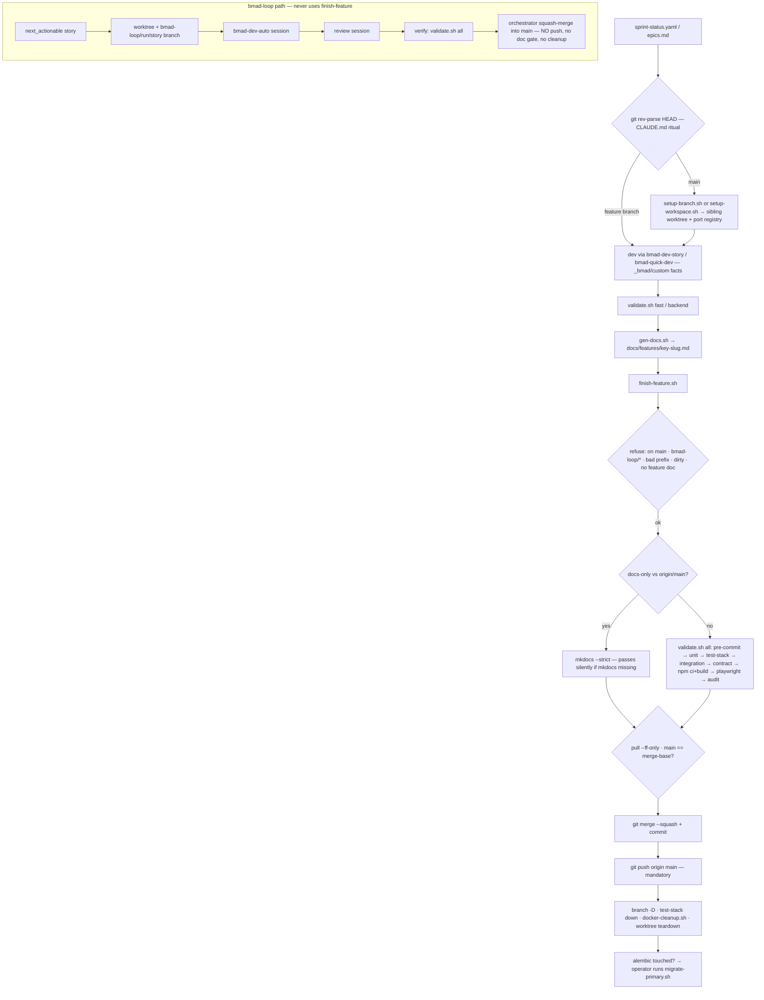

# Development harness review — imoveis (2026-10-07)

**Question asked:** map the whole AI development harness, judge what each piece earns, and compare with Felipe's other projects, bmad-loop's own expectations, and current Claude Code / BMAD practice.

**Method:** file-level inventory of every gate, script, override and mirror; git history of `main` (487 commits); the seven preserved bmad-loop runs; the six sibling repos under `C:\Workfolder`; Anthropic's Claude Code docs, BMAD v6 docs and practitioner write-ups as of 2026-10. Evidence is cited inline; nothing below is asserted from memory. Four subagent reports back this document; their raw output is not committed.

## 1. Verdict

The harness is built on one correct insight and one wrong turn.

- **Correct:** the primary Docker stack must be untouchable, so validation runs on a throwaway test stack. No primary-data incident since BIN-60, and the two gate catches the retros credit (the all-local config pin, the `.env.local` bleed) both come from this layer. Keep it.
- **Wrong turn:** everything *around* that gate became a bespoke reimplementation of git, GitHub and the orchestrator. `finish-feature.sh` (322 lines) decides what to validate, squash-merges, pushes, deletes branches, tears down worktrees and prunes Docker, on every finish, for every change. bmad-loop never calls it (the orchestrator does its own squash-merge and never pushes); no sibling project has anything like it; no public guidance recommends it. Its guards are also prose-enforced: the repo has **zero** `PreToolUse` hooks, so every "NEVER" in CLAUDE.md is a request, not a rule.

The numbers behind that judgment:

| Figure | Value | Source |
| --- | --- | --- |
| Gate/harness scripts | 20 files, 3,089 lines of bash (`lib.sh` alone 447) | `wc -l scripts/agent` |
| Prose rules loaded per session | 1,525 lines across 8 files, 4 of them gitignored and unsyncable | inventory §3 |
| Commits that touch harness files | 76 of 487 (16%); on `scripts/agent/` 25 of 51 are fixes to the harness itself | git evidence §1–2 |
| Troubleshooting bullets caused by the harness (ports, env, worktrees, Windows, git traps) | ≥30 of ~45 | git evidence §3b |
| Full `validate.sh all` | 6–8 min, 65–70% of it the 2,146-test SQLite unit suite (255 s) | `.run/windows-finish.log` |
| Docs-only finish | ~80 s, of which mkdocs is 3 s; the rest is fetch, test-stack down, docker cleanup | `.run/windows-closure-finish.log`, this session's `finish.log` |
| bmad-loop runs | 7 runs in 8 days (Aug 5–13), 14 units merged, nothing since; `[verify]` was empty in 6 of 7 | run journals |
| Loop stories ending in "ask the human" | 5 of 14 (`awaiting-operator`), all primary-host actions; 3 of those only because Docker Desktop was down | run ATTENTION files |
| Tool re-platformings in 3 months | 4 (Goose → Cline → Cursor → Claude/BMad → native Windows) | git top-10 harness commits |

## 2. Map



Layers and their size:

| Layer | What is there | Lines |
| --- | --- | --- |
| Gate scripts `scripts/agent/` | validate, finish-feature, lib, test-stack, ensure-test-db, teardown, docker-cleanup (+lib), migrate-primary, audit-deps, validate-scrapers, validate-ai, gen-docs, setup-branch, setup-workspace, setup-worktree, workspace-status, run-services, setup-tools, lint | 3,089 |
| Operator scripts `scripts/` | start/stop/restart/clean/dev/setup/test + root `lib.sh` (a second logging/compose shim) + backfill installers (.sh 651, .ps1 151) + `scripts/windows/backfill_host.py` | ~1,300 |
| Instruction files | CLAUDE.md 264 · `.cursor/rules/imoveis-core.mdc` 223 (gitignored) · AGENTS.md 127 (gitignored) · `docs/ai/*` 804 (gitignored) · `_bmad-output/project-context.md` 107 (stale, dated 2026-08-05) | 1,525 |
| BMad | 89 skills vendored twice (`.agents/skills` committed, `.claude/skills` ignored, byte-identical, 390k lines); `_bmad/custom/` 4 overrides (74 lines); bmad-loop `policy.toml` + hook relay | — |
| Hooks | `.claude/settings.json`: SessionStart/Stop/SessionEnd/PreCompact → bmad-loop event relay only. **No PreToolUse, no permission deny rules, no git hooks installed** (`pre-commit install` never ran) | — |
| CI | `docs.yml` (deploy on push to main, non-gating), `nightly.yml` (scraper drift canary), Dependabot (10 PRs pending, unvalidated) | — |
| Docs about the harness | 6 ADRs (4 about the harness), `harness-troubleshooting.md` 130, `setup.md` sections (3 of them stale: still describe the retired CI and `pre-commit install`) | — |

## 3. What the evidence says, piece by piece

### 3.1 Which parts demonstrably earned their keep

1. **Ephemeral test stack + primary inviolability** (`test-stack.sh`, `validate.sh` wiring, `teardown.sh` fail-closed). Zero primary incidents after the surgery; the loop's only hard failures were infrastructure (Docker down), never data loss.
2. **The all-local config unit pin** (`test_enrichment_routing_default_all_local`). Caught DW-31: a runbook that would have committed a cloud routing map.
3. **`load_workspace_env` allowlist** (DW-33). Caught `.env.local` leaking the runner's env into pytest.
4. **Push-after-merge.** The one time merges stayed local (bmad-loop, Epic 1), origin ended 9 commits behind. The rule is right; the 322-line script is not the only way to enforce it.
5. **Feature-doc requirement.** Caught story 1.4's silent absorption. Cheap, keep as a check, not necessarily in the merge script.
6. **Frozen intent contracts + fresh-context review** (BMad specs, bmad-loop review). Review passes fell from 13 to 5 between epics; the retros credit review, not the gate, with every silent-corruption catch.
7. **`migrate-primary.sh` mutual exclusion.** Correct design for a long-running cloud backfill sharing one DB; unit-tested; operator-only.

### 3.2 Which parts cost more than they return

1. **`finish-feature.sh` as the only door to main.** Docs-only finishes spend ~75 s on Docker teardown and cleanup that have nothing to do with the change. Code finishes always run the 6–8 min `all` tier even when the diff is one Python file. It refuses bmad-loop branches because the two merge machineries raced (runs 1 and 2); the fix was a refusal instead of removing the duplication. And it has a hole: a docs-only branch with mkdocs missing merges with no check at all (`lib.sh:299-300`), while `_bmad/*.py`, `_bmad/custom/*.toml` and any `*.md` anywhere count as "docs".
2. **Parallel-worktree machinery** (`setup-workspace`, `setup-worktree` 251 lines, `workspace-status`, `run-services`, the port registry + flock in `lib.sh`, `.cursor`/`.claude` symlinking, `teardown --remove`). Evidence of use: no worktree exists today; bmad-loop creates its own; Claude Code now has native `--worktree`; the Windows symlink step is a copy. It generated at least six troubleshooting entries (Playwright port clash, missing `API_KEY`, teardown killing the subagent, locked worktree, `--help` creating a worktree, soft-reset trap).
3. **Docker cleanup on every finish** (`docker-cleanup.sh` + lib, 200 lines, unit-tested). Image pruning is housekeeping, not a merge concern. It runs 15+ times per epic for a benefit that a weekly task would provide.
4. **Dependency audit inside `validate.sh all`** (`audit-deps.sh`, 409 lines, two network calls with 180 s timeouts each). Advisory by design, so it can never change the verdict; it only adds minutes and a known hang (`AUDIT_TIMEOUT=0`). The nightly GitHub workflow already exists and is the natural home.
5. **`setup-tools.sh`** pip-installs unpinned tools and runs `npm install` from inside the gate. A gate that mutates the environment is a surprise waiting to happen on a lockfile-pinned project.
6. **The instruction-file mirrors.** `.cursor/rules`, `AGENTS.md` and `docs/ai/*` are gitignored, so the CLAUDE.md rule "keep the mirror in sync" is unverifiable by construction; `AGENTS.md` already carries a stale claim; `_bmad-output/project-context.md` contradicts `lib.sh` on branch names. Cursor is no longer the driver (zero Cursor commits since August).
7. **CLAUDE.md at 264 lines.** Anthropic's current docs target under 200 and say procedures belong in skills and must-hold rules in hooks; Claude Code warns on length at startup. About a third of the file is session ritual and end-of-task procedure that a SessionStart hook and a `ship` command would do deterministically.
8. **`lint.sh`** has no caller and a different flake8 ignore list than pre-commit. Dead.
9. **pre-commit's pre-push hooks** (`pytest-unit`, `frontend-build`) never run: git hooks are not installed, and `validate.sh` only runs the commit stage.
10. **ESLint never gates** (`validate.sh:105` downgrades failure to a warning) — a frontend lint error cannot block a merge today, despite the prose saying lint is the merge gate.

### 3.3 The loop and the gate do not fit each other

- bmad-loop's contract (its README and the fork you run) is: run `[verify].commands`, squash-merge locally, never push. imoveis's contract is: validate, squash-merge, push, clean. The overlap produced the `bmad-loop/*` refusal, the fu11 "merge ownership" story and the Epic 1 origin gap. Two merge paths for one repo is the root cause; the fix so far has been to fence them, not to pick one.
- `[verify]` was empty for 6 of 7 runs, so the orchestrator trusted the dev session to have run the gate. Since run 7 it runs `validate.sh all` (6–8 min) after every dev and review pass.
- A gate that needs the host's Docker Desktop parked three stories as `awaiting-operator` when the daemon was down. The protection is correct; the consequence is that unattended runs stop being unattended.
- The `2.1 ← 2.7 + DW-32` wave gates live in YAML comments the orchestrator cannot read; story 2.1 was only stopped because the dev session read a "DO NOT START" comment.

### 3.4 How the sibling projects do it

| Project | Gate | Merge to main | Push |
| --- | --- | --- | --- |
| **bmad-loop-engine** (public) | GitHub Actions `ci.yml`: pytest Linux+Windows matrix, lint, pyright, build | **261 "Merge pull request" commits** — PR flow | GitHub |
| **bmad-fanout** | one `scripts/validate.py` with **measured tiers** (fast 74–98 s while coding; `not engine` before merge; full ~16 min at epic end), documented in CLAUDE.md | feature branch merged when the tier passes; orchestrator squash | by hand |
| **nala-assistant** | three npm gates + `verify-gates.mjs` **mutation probes** that prove each gate still fails on a planted defect | orchestrator `merge_strategy="merge"` | by hand |
| **personal-assistant** | lint checkers with their own tests + jest; CLAUDE.md: "commits straight to main, no branch, no PR" | direct | **guarded `Stop` hook `git-autopush.sh`** |
| **imoveis** | 20 bash scripts, pre-commit, Docker test stack, Playwright | `finish-feature.sh` local squash | script |

Only imoveis has a merge script. The two patterns that work elsewhere — a single tiered validate entrypoint in Python, and a hook that pushes once the run settles — are both simpler and already proven on this machine.

### 3.5 What the platforms now provide

- **Hooks are enforcement; CLAUDE.md is not.** Anthropic's docs: a `PreToolUse` hook that returns `deny` blocks the tool "even in `bypassPermissions` mode"; CLAUDE.md content is "context, not enforced configuration". A Stop hook can run a script and refuse to end the turn until it passes.
- **AGENTS.md is the shared standard.** Claude Code reads it natively (v2.1.277); Codex, Cursor, Copilot and Gemini CLI do too. The recommended shape is one AGENTS.md plus a thin CLAUDE.md that imports it.
- **BMAD v6.11 changed the dev cycle.** `bmad-create-story` and `bmad-dev-story` are deprecated shims; the chain is now `sprint-planning → build → code-review`, and `bmad-quick-dev.toml` became `bmad-build.toml`. The `_bmad/custom/` bindings target the old names.
- **bmad-loop is official** (`bmad-code-org/bmad-loop`, installable from the BMAD installer). Its design principle is "no LLM in the control loop", and it expects project-local verify commands — exactly what `validate.sh` is. What it does not expect is a project-local merge/push script.
- **GitHub branch protection on a private repo needs GitHub Pro.** On the Free plan there is no platform hard stop against pushing to `main` in a private repo; the practitioner consensus for that case is a user-level pre-push / `PreToolUse` guard, which is cheap and holds under every permission mode.
- **Gate budget.** The cited ideal is a 10-minute build; the trunk-based pattern splits a fast pre-merge tier (unit + contract) from slower post-merge or nightly lanes (Docker integration, e2e, audits).

## 4. Component verdicts

| Component | Verdict | Why |
| --- | --- | --- |
| `test-stack.sh`, `ensure-test-db.sh`, `docker-compose.test.yml` | **Keep** | The protection that works. Fix the shared `imoveis-test` name when `.env.local` is absent (two validations can kill each other's stack). |
| `validate.sh` | **Keep, restructure** | Make tiers path-driven and faster (§5). Remove `setup-tools.sh` sourcing, the audit stage, the ESLint downgrade. Port to Python like bmad-fanout to drop the Git-Bash-full-path and CRLF rules on Windows. |
| `lib.sh` | **Shrink to ~80 lines** | Keep Python discovery, `load_workspace_env` allowlist, `is_docs_only`. Delete the port registry, flock, worktree helpers, branch-type validation. |
| `finish-feature.sh` | **Replace** | A ~50-line `ship` step: pick tier by diff → run it → `git merge --squash` → `git push`. Push itself is guarded by a hook (§5), so the script stops being the only door. No cleanup, no teardown, no branch deletion ceremony. |
| `setup-branch.sh` | **Simplify or drop** | A SessionStart hook that prints branch + status replaces the "FIRST action" ritual; branch creation is `git switch -c`. Conventional-branch validation adds nothing a solo repo needs. |
| `setup-workspace.sh`, `setup-worktree.sh`, `workspace-status.sh`, `run-services.sh`, `teardown.sh --remove` | **Drop (archive)** | No worktree in use; bmad-loop and Claude Code both manage their own; source of ≥6 incidents. Keep only the primary-refusal idea, as a hook. |
| `docker-cleanup.sh` (+lib, tests) | **Move out of the merge path** | Weekly operator task or a scheduled job; never per finish. |
| `audit-deps.sh` | **Move to `nightly.yml`** | Advisory by design; GitHub already runs nightly; Dependabot covers the rest. |
| `migrate-primary.sh` | **Keep** | Operator-only, tested, correct for the backfill runner. Close DW-32 (`start.sh` bypasses it) as part of the same cleanup. |
| `validate-scrapers.sh`, `validate-ai.sh` | **Keep, trigger by path** | The tiering selects them when `src/adapters/scrapers` / `src/adapters/ai` or `prompts.py` change, instead of a prose rule the agent must remember. `validate-ai.sh` silently passing when Ollama is down should at least print loudly. |
| `gen-docs.sh`, feature-doc check | **Keep the check, drop the generator** | The check (story-key branch → doc exists) is one `ls`; keep it in `ship`. The template is a skill's job. |
| `lint.sh`, `setup-tools.sh`, `docker-compose.ci.yml` | **Delete** | Dead or harmful. |
| pre-commit | **Keep; actually install it** | `pre-commit install` so lint runs at commit time; drop the never-run pre-push stage; add eslint as a hook so it gates. |
| `.claude/settings.json` | **Add the guards** | PreToolUse deny on `git push` to main without a validation stamp, on `git push --force`, on `docker compose … -p imoveis` / `down -v`, on editing `.env.local`. SessionStart hook prints branch/status. Keep the bmad-loop relay. |
| CLAUDE.md | **Rewrite to ≤120 lines** | Facts and always-rules only. Rituals → hooks. Procedures (finish, migrate, scraper refresh) → skills. |
| `.cursor/rules`, `AGENTS.md`, `docs/ai/*` | **Collapse to one AGENTS.md** | AGENTS.md committed, CLAUDE.md = `@AGENTS.md` + Claude-only lines. Delete the Cursor mirror and `docs/ai/`. |
| `_bmad-output/project-context.md` | **Regenerate or delete** | Stale (Aug 5) and contradicts `lib.sh`. If kept, it must be derived from AGENTS.md, not hand-written. |
| `.agents/skills` (committed, 390k lines) + `.claude/skills` (ignored copy) | **Keep one copy** | Vendoring 89 skills in git is BMAD's install model, but the duplicate is pure weight. Prune the unused modules (cis, wds, tea, bmb) at the next BMAD sync. |
| `_bmad/custom/` overrides | **Keep, rewrite for v6.11** | Three facts are enough: run the tiered validate; never touch the primary project; the push guard decides merges. Rename for `bmad-build`. |
| bmad-loop `policy.toml` | **Keep; set `[verify]` to the pre-merge tier** | Full tier at epic boundaries only. Add a post-run push (the personal-assistant hook pattern) so origin never lags. Replace YAML-comment wave gates with real story ordering. |
| ADR 0002 / 0004 | **Supersede with one ADR** | "Local tiered gate + hook-enforced push; no merge script; no worktree machinery." |
| `docs/harness-troubleshooting.md` | **Prune after the cut** | Most of its 45 bullets describe machinery that will no longer exist. |
| `docs.yml`, `nightly.yml`, Dependabot | **Keep** | Non-gating, cheap, already correct. Validate the 10 Dependabot PRs once the fast tier exists. |

## 5. Target shape

### 5.1 Tiered validation chosen by the diff, not by memory

```
validate.py [--tier auto|docs|fast|backend|full]   (auto = derive from `git diff --name-only origin/main...HEAD`)
  docs    : mkdocs build --strict                                  (~5 s)
  fast    : pre-commit (commit stage) + eslint + unit via pytest -n auto   (target ≤ 90 s)
  backend : fast + test-stack + integration + contract + alembic check     (+ ~40 s)
  full    : backend + npm ci/build + playwright                            (+ ~90 s)
  plus, when the diff touches them: validate-scrapers (scrapers/), validate-ai (ai/ or prompts.py)
```

- Unit suite: `pytest-xdist -n auto` and no `-v` should bring 255 s to roughly 60–90 s on this host; the 30 s per-test timeout stays.
- `npm ci` only when `package-lock.json` changed since the last stamp; otherwise `npm run build` alone.
- The tier writes a stamp `.run/validated/<tree-hash>.<tier>` on success. That stamp is what the push guard reads.
- Frontend-only diffs never start Docker; docs-only diffs never run pre-commit on all files.

### 5.2 Push guarded by a hook, not by a script that owns the merge

`.claude/settings.json`:

- `PreToolUse` on `Bash` matching any `git push` form: deny unless (a) the target is not `main`, or (b) `.run/validated/<HEAD tree>.{backend|full}` exists (docs tier accepted when the diff is docs-only). Deny `--force` always.
- `PreToolUse` deny on `docker compose` with `-p imoveis` or against the primary project files, on `down -v`, on `docker system prune`, on `docker volume rm`.
- `PreToolUse` deny on editing `.env.local` and `configs/anchors.local.yaml`.
- `SessionStart`: print branch, dirty state, last validation stamp. This replaces the "FIRST action" ritual.
- Keep the bmad-loop relay hooks.

With this, the agent may merge however git allows (squash or fast-forward), on a branch or directly on main; what it cannot do is push an unvalidated tree. The same guard works under `bypassPermissions`, which is where bmad-loop sessions run.

### 5.3 `ship` becomes a skill plus a 50-line script

`scripts/ship.py`: refuse if dirty → `validate.py --tier auto` → feature-doc check for story-key branches → `git merge --squash` into main (or commit on main) → `git push`. No Docker teardown, no cleanup, no worktree logic, no branch-type rules. bmad-loop keeps its own squash-merge and gains a push at run settle; `ship` is for interactive sessions only, so the two paths no longer overlap and the `bmad-loop/*` refusal disappears.

### 5.4 One instruction file

- `AGENTS.md` (committed, ≤120 lines): stack, layout, the three invariants (primary stack untouchable; validate by tier; push is hook-gated), tracking model, where the skills are.
- `CLAUDE.md`: `@AGENTS.md` plus Claude-only notes (Windows interpreter path, memory pointers).
- Delete `.cursor/rules/*`, `docs/ai/*`; regenerate `_bmad-output/project-context.md` from AGENTS.md or drop it.
- Procedures move to skills under `.claude/skills/` or stay in the BMad overrides: ship, migrate-primary runbook, scraper cassette refresh, backfill operator checklist.

### 5.5 Migration in four cuts, each shippable alone

1. **Speed and tiers** (1 session): `validate.py` with path-driven tiers, xdist, stamps; `audit-deps` to nightly; delete `lint.sh`, `setup-tools.sh`, `docker-compose.ci.yml`; `pre-commit install`. Measure the tiers and write the numbers into AGENTS.md like bmad-fanout does.
2. **Hooks** (1 session): the PreToolUse guards and SessionStart hook; a `verify-gates` style mutation probe that proves the push guard and the primary guard actually block (nala's pattern).
3. **Merge path** (1 session): `ship.py` replaces `finish-feature.sh`; bmad-loop `[verify]` set to the backend tier with full tier at epic gates; post-run push hook. Archive the worktree scripts and `docker-cleanup` to `scripts/ops/`.
4. **Prose** (1 session): AGENTS.md + thin CLAUDE.md; delete mirrors; rewrite `_bmad/custom/` for BMAD v6.11 names; one superseding ADR; prune `harness-troubleshooting.md`; fix the stale `setup.md` sections.

Expected end state: ~800 lines of gate code instead of ~3,100, one instruction file instead of eight, a docs change ships in under 10 s, a one-file backend change in about two minutes, and every "never" is enforced by a hook rather than remembered.

## 6. Decisions for Felipe

1. **Platform hard stop or local hard stop?** GitHub Pro (branch protection on the private repo) + PR + a path-filtered CI would make `main` physically unpushable without green checks, at the cost of reviving the CI maintenance that was retired in August (20 CI-only fix commits in July) and needing a pgvector+PostGIS image on the runner. The recommendation above stays local-first with hook enforcement; say so if you want the PR flow instead.
2. **Should bmad-loop push?** The engine never does. Options: a post-run push hook (as personal-assistant does), or accept that you push after reviewing a run. The recommendation is the hook, since the one time pushes were forgotten origin fell 9 commits behind.
3. **Worktree machinery: archive or delete?** Archive keeps the option of parallel human sessions; evidence says it has not been used since the loop arrived.
4. **Dependabot backlog:** validate the 10 open PRs once the fast tier exists, or close them and rely on the nightly audit.
5. **BMAD v6.11 migration timing:** before or after the harness cut? The override files change names either way; doing both in cut 4 avoids touching `_bmad/custom/` twice.

## 7. Sources

- Inventory, git-history, sibling-project and industry-practice reports produced for this review (subagent output, not committed).
- Repo: `scripts/agent/*`, `.claude/settings.json`, `.pre-commit-config.yaml`, `.bmad-loop/policy.toml`, `docs/adr/0002–0006`, `docs/harness-troubleshooting.md`, `_bmad-output/specs/spec-harness-surgery/.memlog.md`, `_bmad-output/implementation-artifacts/epic-{1,3}-retro-*.md`, `.run/windows-*.log`.
- Siblings: `C:\Workfolder\bmad-fanout\CLAUDE.md` (tier table), `C:\Workfolder\nala-assistant\scripts\verify-gates.mjs`, `C:\Workfolder\personal-assistant\scripts\git-autopush.sh`, `C:\Workfolder\bmad-loop-engine\README.md` and `.github/workflows/ci.yml`.
- External: code.claude.com/docs (memory, best-practices, hooks-guide, permission-modes, worktrees, github-actions), docs.bmad-method.org (build, customize, autonomous loops), github.com/bmad-code-org/bmad-loop, agents.md, GitHub docs on protected branches and Actions billing, practitioner posts cited in the research report.
